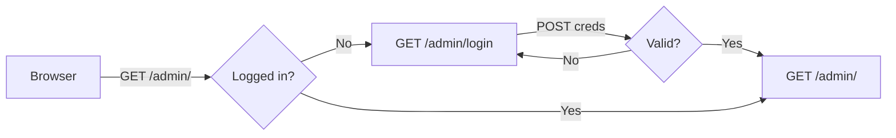
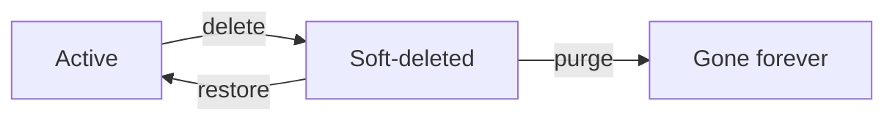

# mehboob-portfolio — Admin Guide

Admin at `/admin`, login-gated via flask-login. Credentials come from `secrets.json → ADMIN_USERNAME / ADMIN_PASSWORD`, **synced automatically on every startup**.

## Access

CSRF enforced on all admin POSTs.

## Route table

| Method | Route | View | Purpose |
|---|---|---|---|
| GET/POST | `/admin/login` | `login()` | sign in |
| GET | `/admin/logout` | `logout()` | sign out |
| GET | `/admin/` | `dashboard()` | counts |
| GET/POST | `/admin/campaigns` | `campaigns()` | list/create campaign |
| POST | `/admin/campaigns/<id>/delete` | `delete_campaign()` | soft delete |
| POST | `/admin/campaigns/<id>/restore` | `restore_campaign()` | restore |
| POST | `/admin/campaigns/<id>/purge` | `purge_campaign()` | hard delete |
| POST | `/admin/campaigns/bulk` | `campaigns_bulk()` | bulk action |
| GET | `/admin/qr` | `qr_list()` | QR list |
| GET/POST | `/admin/qr/new` | `qr_new()` | create QR |
| GET/POST | `/admin/qr/<id>` | `qr_edit()` | edit QR (destination!) |
| GET | `/admin/qr/<id>/stats` | `qr_stats()` | scan analytics |
| GET | `/admin/qr/<id>/export-scans.csv` | `qr_scans_csv()` | CSV export |
| POST | `/admin/qr/<id>/delete` | `qr_delete()` | soft delete |
| POST | `/admin/qr/<id>/restore` | `qr_restore()` | restore |
| POST | `/admin/scans/<id>/delete` | `scan_delete()` | soft delete |
| POST | `/admin/scans/<id>/restore` | `scan_restore()` | restore |
| POST | `/admin/scans/<id>/purge` | `scan_purge()` | hard delete |
| POST | `/admin/scans/bulk` | `scans_bulk()` | bulk action |
| GET | `/admin/leads` | `leads()` | list leads |
| POST | `/admin/leads/<id>/delete` | `lead_delete()` | soft delete |
| POST | `/admin/leads/<id>/restore` | `lead_restore()` | restore |
| POST | `/admin/leads/<id>/purge` | `lead_purge()` | hard delete |
| POST | `/admin/leads/bulk` | `leads_bulk()` | bulk action |
| GET | `/admin/leads/export.csv` | `leads_csv()` | leads CSV export |

## Soft-delete model

Same as the sibling project: `is_deleted` flag + restore/purge/bulk on every entity.

## Key flows

### Create a QR

1. `/admin/qr/new`
2. slug (unique), label, campaign (optional)
3. destination URL — must pass `_valid_destination_url`
4. save → printed card uses `https://<domain>/r/<slug>`

### Change a destination (the killer feature)

1. `/admin/qr/<id>`
2. edit `destination_url`
3. save — all future scans go to the new target; the printed card is untouched.

### Read analytics

`/admin/qr/<id>/stats` → device/browser/OS breakdown, app source, geo, UTM, timeline. Export raw rows to CSV when needed.

## Templates

- Layout: `app/templates/admin/base.html`
- Pages: `login`, `dashboard`, `campaigns`, `qr_list`, `qr_edit`, `qr_stats`, `leads`, `lead_detail`

## Notes for developers

- All POST forms need `{{ csrf_token() }}`.
- Soft-delete is the default; purge is permanent.
- QR destination validation is server-side (tested).
- Keep KISS: CRUD in routes, no business logic in models.
