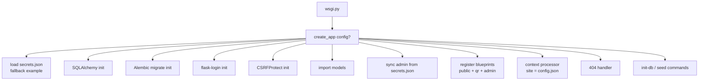
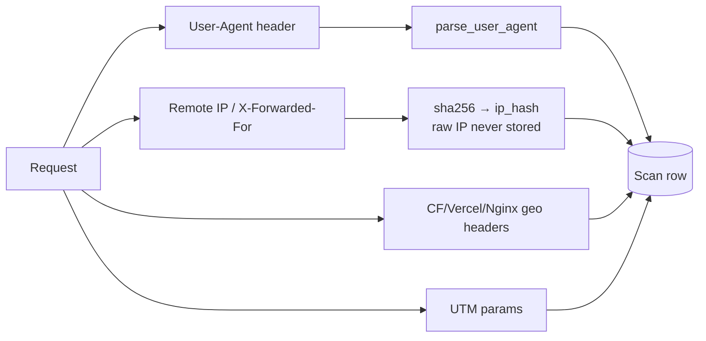
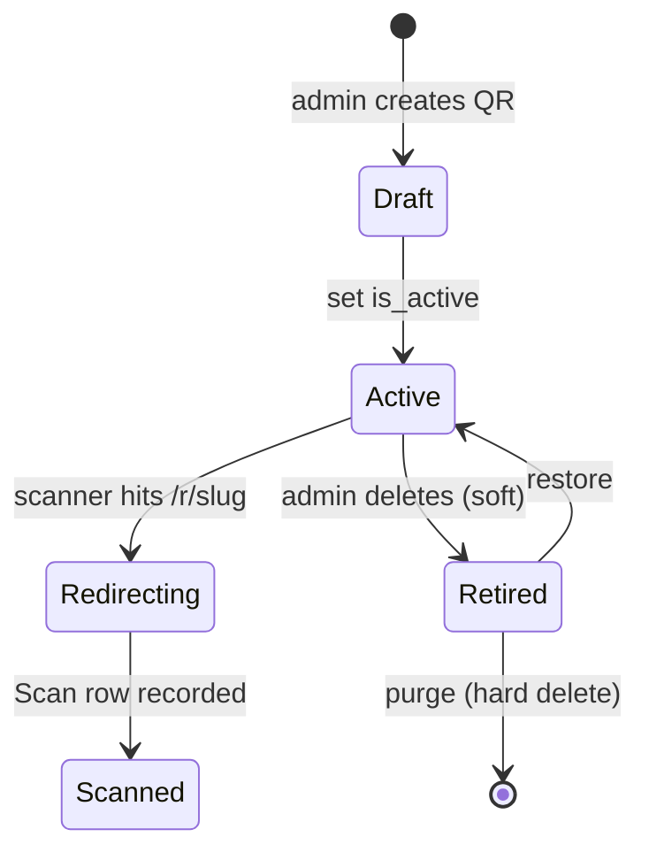

# mehboob-portfolio — Architecture

## Principles (KISS)

- **One file per concern** — models, helpers, extensions are single files.
- **No business logic in models** — plain tables.
- **Config over code** — all personal copy in JSON.
- **Privacy by design** — scan analytics never stores raw IPs.
- **Fail loudly** — templates have no fallback literals for JSON-driven values.

## Application factory

`app/__init__.py` exposes `create_app()`:



Notable: admin credentials are **synced from secrets.json on every startup** (`_sync_admin_from_secrets`) — the DB user always matches the config.

## Blueprints

| Blueprint | File | Prefix | Purpose |
|---|---|---|---|
| `public` | `app/public.py` | `/` | single-page site + legacy redirects |
| `qr` | `app/qr.py` | `/r/` | dynamic QR redirect + scan capture |
| `admin` | `app/admin.py` | `/admin` | login-gated management |

## Public routes

| Route | View | Data |
|---|---|---|
| `/` | `home()` | `content/{about,experience,projects,contact}.json` + `config.json` |
| `/about` `/experience` `/projects` `/trading-systems` `/contact` | anchor redirects | 302 → `#about` `#experience` `#projects` `#engine` `#contact` |

The home page is a **single scrolling page**; legacy paths exist so old links keep working (tests assert these redirects).

## QR redirect engine (`app/qr.py`)

```mermaid
sequenceDiagram
    participant U as Scanner (camera)
    participant R as GET /r/&lt;slug&gt;
    participant DB as Database
    U->>R: scan QR
    R->>DB: find QrCode by slug (not deleted)
    alt not found
        R-->>U: 404
    else found
        R->>DB: record Scan (best-effort, never raises)
        R-->>U: 302 → destination_url
    end
```

- **302 (temporary)** so search engines don't cache the redirect target.
- Scan capture is best-effort — a broken scan never 500s.
- Only **active** QRs record scans (inactive still redirects, no log).
- See [qr-manager.md](qr-manager.md) for the full spec.

### Scan recording (privacy)



- `anonymize_ip()` — sha256 of the IP; raw IP is never persisted.
- `parse_user_agent()` — device/browser/OS from UA via `user-agents` lib; safe on garbage.
- Geo only when proxy headers present; localhost marked "Local Dev".

## Admin surface

Login-gated. Everything soft-delete (`is_deleted` + restore/purge):

- `/admin/` — dashboard with counts
- `/admin/campaigns` + delete/restore/purge/bulk
- `/admin/qr` + `/qr/new` + `/qr/<id>` (edit) + `/qr/<id>/stats` + `/qr/<id>/export-scans.csv`
- `/admin/scans/...` + `/admin/leads/...` (list, CSV, soft-delete ops)

See [admin.md](admin.md) for the full route table.

## Data flow — QR lifecycle



## Static assets & frontend

- `app/static/css/app.css` + `home.css` — design tokens + components
- `app/static/js/hero.js` — hero ticker animation
- `app/static/js/theme.js` — theme switching (systems-light, monochrome, quant-dark, warm-monograph)
- `app/static/img/` — favicon, brand logo
- `app/static/resume/MehboobMeghaniResume.md` — downloadable CV

Frontend details: [frontend.md](frontend.md).

## Configuration sources

| File | Purpose |
|---|---|
| `data/config.json` | Site identity, masthead, benchmarks, nav, themes, `site.expo_url` |
| `data/content/*.json` | Page copy: about, experience, projects, contact, home, trading_systems |
| `data/secrets.json` | **gitignored** — DB URL, session key, admin creds |
| `data/app.db` | Dev SQLite |

## Related

- [database.md](database.md) — schema
- [content-model.md](content-model.md) — every JSON key
- [qr-manager.md](qr-manager.md) — QR spec
- [admin.md](admin.md) — admin routes
- [frontend.md](frontend.md) — design system
- [deployment.md](deployment.md) — prod topology
