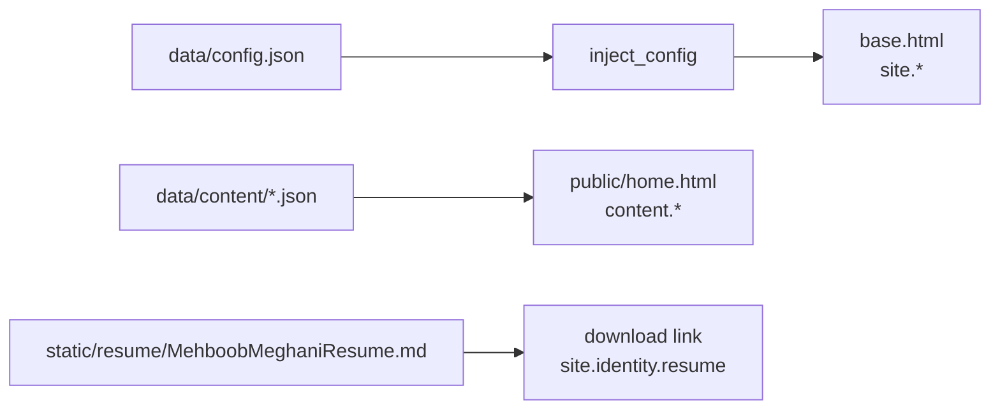

# mehboob-portfolio — Content Model & Configuration

All personal copy is JSON-driven. Two layers: `data/config.json` (site-wide) and `data/content/*.json` (per-section). No fallback literals in templates — keep JSON complete.

## The `site` injection

`app/__init__.py → inject_config()` loads `data/config.json` and exposes it as `site` to every template.



## `data/config.json` — site-wide

| Key | Type | Consumed by |
|---|---|---|
| `site.title` | string | `<title>` in `base.html` |
| `site.expo_url` | string | link to Itqan expo demo |
| `site.year` | number | footer © year |
| `identity.name` | string | masthead + brand alt |
| `identity.location` | string | contact section |
| `identity.focus` | string | hero context |
| `identity.summary` | string | about |
| `identity.resume` | string | CV filename |
| `identity.contact.phone` / `.email` | string | contact channels |
| `identity.links.github` / `.linkedin` | string | social links |
| `masthead.name` / `.role` / `.location` / `.context` | string | masthead display |
| `benchmarks[]` | array | hero benchmark cards (value, param, scope, context) |
| `benchmark.headline` / `.stats[]` / `.detail` | — | benchmark section (legacy shape) |
| `nav[]` | array | anchor nav (label, href `#...`) |
| `themes[]` | array | theme list (id, name) |

> Both `benchmarks[]` (new) and `benchmark` (legacy) exist; templates prefer `benchmarks` and fall back to `benchmark.stats`.

## `data/content/*.json` — per-section copy

Loaded by `home()` (`app/public.py`) and passed as `content.{section}`.

| File | Section keys |
|---|---|
| `about.json` | `heading`, `intro`, `systems_architecture[]`, `skills`, `education` |
| `experience.json` | `heading`, `intro`, `roles[]`, `education` |
| `projects.json` | `heading`, `intro`, `flagship_systems[]`, `secondary_artifacts[]`, `projects[]` |
| `trading_systems.json` | `heading`, `sub`, `benchmark_note`, `architecture_title`, `architecture_blurb`, `pipeline_note` |
| `contact.json` | `heading`, `lead`, `success_message`, `labels{}`, `interests[]` |
| `home.json` | `hero_headline`, `hero_sub`, `cta_primary`, `cta_secondary` |

### Example — `about.json`

```json
{
  "heading": "About",
  "intro": "...",
  "systems_architecture": [ { "title": "...", "blurb": "...", "icon": "..." } ],
  "skills": { "groups": [ { "category": "...", "items": ["..."] } ] },
  "education": { "items": [ { "degree": "...", "school": "...", "year": "..." } ] }
}
```

> Exact shapes vary per file — read the file before editing. The template accesses keys defensively (`content.about.systems_architecture if ...`).

## Templates that consume `site.*`

| Template | Key | Where |
|---|---|---|
| `base.html` | `site.site.title` | `<title>` |
| `base.html` | `site.identity.name` | brand alt, footer |
| `base.html` | `site.site.year` | footer © |
| `base.html` | `site.identity.resume` | CV download link |
| `base.html` | `site.identity.links.*` | GitHub/LinkedIn |
| `public/home.html` | `site.identity.name` | masthead |
| `public/home.html` | `site.masthead.*` | masthead role/context |
| `public/home.html` | `site.identity.contact.*` | channels |
| `public/home.html` | `site.benchmarks` / `site.benchmark` | benchmark cards |
| `public/home.html` | `content.projects.flagship_systems` | systems section |
| `public/home.html` | `content.about.systems_architecture` | architecture section |
| `public/home.html` | `content.experience.roles` / `.education` | chronology |
| `public/home.html` | `content.projects.secondary_artifacts` | artifacts |
| `public/home.html` | `content.contact.*` | contact form |

## Editing checklist

1. Find the right file (tables above).
2. Keep JSON valid — a broken file 500s every page reading it.
3. Restart not needed in dev (read per request).
4. Verify with `curl localhost:5000/` or the test suite (tests assert section ids).

## The downloadable CV

- `app/static/resume/MehboobMeghaniResume.md` — served as a download (filename from `site.identity.resume`).
- Source of truth: repo-root `MehboobMeghaniResume.md` (copy into static on update).
