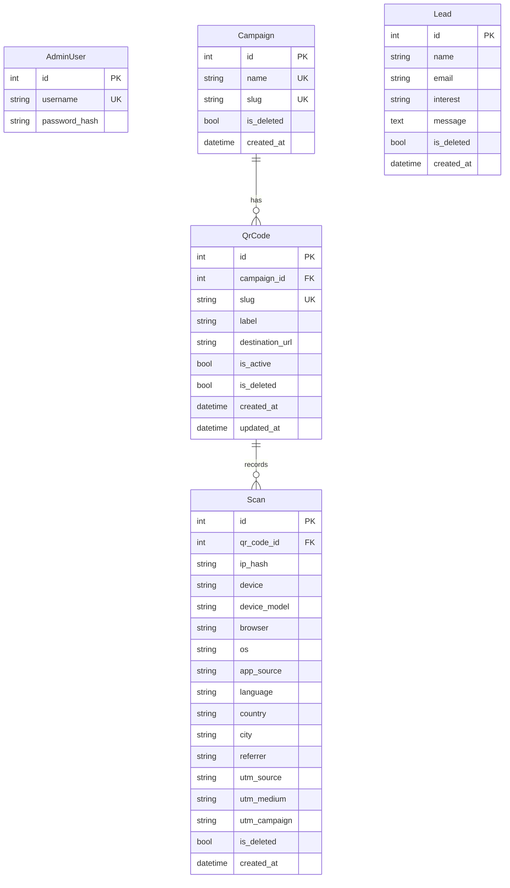

# mehboob-portfolio — Database Schema

All models in `app/models.py` (one file, KISS). Plain SQLAlchemy tables, no business logic. Timestamps UTC via `_utcnow()`.

## Entity relationship overview



## Tables

### `admin_users` — admin account(s)

| Column | Type | Notes |
|---|---|---|
| id | Integer PK | |
| username | String(80), unique, not null | |
| password_hash | String(255), not null | werkzeug hash |

- flask-login `UserMixin`.
- **Synced from `secrets.json` on every startup** (`_sync_admin_from_secrets` in `app/__init__.py`) — create/update/rename as needed.

### `campaigns` — QR campaigns

| Column | Type | Notes |
|---|---|---|
| id | Integer PK | |
| name | String(120), unique, not null | |
| slug | String(80), unique, not null | |
| is_deleted | Boolean default False | soft delete |
| created_at | DateTime default UTC | |

- Groups QR codes; campaign name becomes the default `utm_campaign` on scans.

### `qr_codes` — the printed cards

| Column | Type | Notes |
|---|---|---|
| id | Integer PK | |
| campaign_id | Integer FK → campaigns.id, nullable | |
| slug | String(80), unique, not null | URL path `/r/<slug>` |
| label | String(200), default "" | display name |
| destination_url | String(2000), not null | **mutable** — the key feature |
| is_active | Boolean default True | inactive QRs redirect but don't log scans |
| is_deleted | Boolean default False | soft delete |
| created_at / updated_at | DateTime default UTC | |

- Destination is edited in admin anytime; the printed QR keeps working.
- URL validated on save (`_valid_destination_url`).

### `scans` — one row per QR scan

| Column | Type | Notes |
|---|---|---|
| id | Integer PK | |
| qr_code_id | Integer FK, not null | |
| ip_hash | String(64) | **sha256 of IP — raw IP never stored** |
| device | String(40) | mobile / tablet / desktop |
| device_model | String(60) | parsed from UA |
| browser | String(60) | family + version |
| os | String(60) | family + version |
| app_source | String(60) | WhatsApp / LinkedIn / camera / ... |
| language | String(30) | from Accept-Language |
| country / city | String(80) | from proxy headers only |
| referrer | String(500) | |
| utm_source / utm_medium / utm_campaign | String(80) | from query params; campaign fallback = campaign name |
| is_deleted | Boolean default False | |
| created_at | DateTime default UTC, indexed | |

### `leads` — contact form submissions

| Column | Type | Notes |
|---|---|---|
| id | Integer PK | |
| name | String(120), not null | |
| email | String(200), not null | |
| interest | String(40) | |
| message | Text | |
| is_deleted | Boolean default False | |
| created_at | DateTime default UTC, indexed | |

## Migrations

Flask-Migrate/Alembic (`migrations/`, initial schema `ac309500b1c7_initial_schema.py`).

```bash
uv run flask db migrate -m "what changed"   # generate
uv run flask db upgrade                     # apply
uv run flask db downgrade                   # rollback (dev)
```

> `init-db` (create_all) is a dev convenience only; prod uses migrations.

## Dev vs prod

| | Dev | Prod |
|---|---|---|
| Engine | SQLite (`data/app.db`) | MySQL via `mysql+pymysql://...` |
| Schema | create_all or migrations | migrations (`flask db upgrade`) |
| Secrets | `secrets.example.json` / defaults | real values in gitignored `secrets.json` |

## Privacy notes

- **Raw IPs are never stored** — only `ip_hash` (sha256).
- Geo fields come exclusively from proxy headers (Cloudflare/Vercel/AWS/Nginx); absent headers → `None` (localhost marked "Local Dev").
- UTM params are captured verbatim (truncated to 80 chars).
