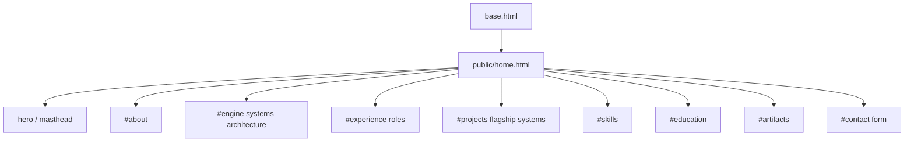

# mehboob-portfolio — Frontend & Design System

Vanilla JS, no build step, no framework. Two stylesheets, two small JS files.

## Files

```
app/static/
├── css/
│   ├── app.css     # design tokens + shared components
│   └── home.css    # single-page layout + sections
├── img/
│   ├── favicon.png
│   └── WhiteGoldTransparent.png   # brand logo
├── js/
│   ├── hero.js     # hero/ticker animation
│   └── theme.js    # theme switcher
└── resume/
    └── MehboobMeghaniResume.md    # downloadable CV
```

## Design tokens (White Golden)

Custom properties in `app.css` `:root`. Shared with the Itqan Trades site.

| Token | Value | Usage |
|---|---|---|
| `--bg-canvas` | `#ffffff` | page background |
| `--bg-surface` | `#fcfaf6` | cards |
| `--text-primary` | `#1c1914` | headings |
| `--text-secondary` | `#757062` | body |
| `--border-subtle` | `#e4e0d6` | hairlines |
| `--gold-primary` | `#b99b5f` | links, icons |
| `--gold-light` | `#cbb183` | hovers |
| `--gold-dark` | `#9a7d43` | hover-strong |
| `--accent-signal` | `#218838` | positive |
| `--accent-danger` | `#c82333` | negative |
| `--font-sans` | Fauna One | body |
| `--font-serif` | Cinzel | headers |

**Rule:** never hardcode colors — always `var(--token)`.

## Themes

`theme.js` toggles a `data-theme` attribute; `config.json → themes[]` lists them:

| id | name |
|---|---|
| `systems-light` | Systems Light |
| `monochrome` | Monochrome |
| `quant-dark` | Quant Dark |
| `warm-monograph` | Warm Monograph |

Each theme overrides the token values in CSS (`:root[data-theme="..."]`).

## Page structure (single page)



Sections render from `content/*.json` via `site.*` / `content.*` (see [content-model.md](content-model.md)).

## Components

- **Masthead** — name, role, context from `config.json → masthead`, contact channels, social links, CV download.
- **Benchmark cards** — `site.benchmarks[]` (or legacy `site.benchmark.stats`), each with value/param/scope/context.
- **Flagship systems** — `content.projects.flagship_systems[]` cards.
- **Channel links** — `.channel-link` styles for email/phone/social.
- **Contact form** — POST `/contact` (CSRF token included), redirects with `?sent=1` on success.

## Legacy anchor redirects

`/about`, `/experience`, `/projects`, `/trading-systems`, `/contact` → 302 to `#section`. Tests assert these — keep them.

## JS behavior

- `hero.js` — hero/ticker animation (dummy ticker canvas per README).
- `theme.js` — theme switching persisted (localStorage), respects system preference default.

## Related

- [architecture.md](architecture.md) — template flow
- [content-model.md](content-model.md) — what drives each section
- Sibling design system: `../itqan-trades/docs/frontend.md`
