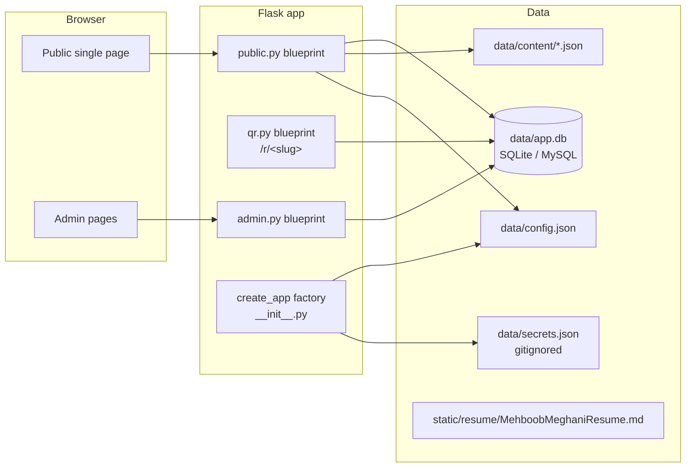

# mehboob-portfolio — Documentation Index

Personal portfolio for **Mehboob Meghani** — Quant Developer (C#, .NET, C++ interop). Single scrolling CV-driven page + **dynamic QR manager** with scan analytics. Public repo.

> **Audience**: future human developers and AI agents. Start here, then follow links. Diagrams are Mermaid.

---

## Quick orientation

| Topic | Doc |
|---|---|
| 🚀 First-time setup, run, test, deploy | [instructions.md](instructions.md) |
| 🧱 Project layout, routes, request flow | [architecture.md](architecture.md) |
| 📦 Database schema (all tables, columns) | [database.md](database.md) |
| 📄 Page copy & config: `config.json` + `content/*.json` | [content-model.md](content-model.md) |
| 🎯 QR redirect engine + scan analytics spec | [qr-manager.md](qr-manager.md) |
| 🔐 Admin: campaigns, QR CRUD, analytics, leads | [admin.md](admin.md) |
| 🌐 Deployment (cPanel/WSGI/MySQL) | [deployment.md](deployment.md) |
| ✨ Frontend: design tokens, themes, hero | [frontend.md](frontend.md) |
| 🗂 What changed and why | [changelog.md](changelog.md) |
| ✅ For AI agents: CLAUDE.md at repo root | [../CLAUDE.md](../CLAUDE.md) |

---

## Stack at a glance

| Concern | Choice |
|---|---|
| Web framework | Flask 3 (WSGI) |
| Templates | Jinja2 |
| ORM / migrations | SQLAlchemy 2 + Flask-Migrate (Alembic) |
| Database | SQLite (dev) / MySQL (prod) |
| Auth | flask-login + werkzeug password hashes |
| CSRF | flask-wtf (global) |
| Frontend | Vanilla JS, `user-agents`, `qrcode`, Pillow |
| Package mgr | `uv` |
| Tests | pytest (`tests/`) |

---

## How the pieces fit



- **Every request** gets `site` (config.json) injected via context processor.
- **`/r/<slug>`** (qr blueprint) records a scan and 302-redirects to the QR's **mutable** destination — the printed card never goes stale.
- **Admin** (login-gated) manages campaigns, QR codes, scan analytics, leads; everything is soft-delete.
- **`secrets.json`** holds `DATABASE_URL`, `SECRET_KEY`, `ADMIN_USERNAME`, `ADMIN_PASSWORD` — never commit it.

---

## Common commands

```bash
uv sync                                   # install deps (Python ≥ 3.11)
cp data/secrets.example.json data/secrets.json   # then edit values
uv run flask --app wsgi:app init-db      # create tables + sync admin
uv run flask --app wsgi:app run          # dev server → http://localhost:5000
uv run pytest                            # run test suite
uv run flask db upgrade                  # apply migrations
```

Full details: [instructions.md](instructions.md).

---

## Route map

| Route | Blueprint | Purpose |
|---|---|---|
| `/` | public | single-page site |
| `/about` `/experience` `/projects` `/trading-systems` `/contact` | public | legacy 302 → `#section` anchors |
| `/r/<slug>` | qr | record scan + 302 to destination |
| `/admin/...` | admin | login-gated management |

---

## Related

- Sibling project: [itqan-trades](../itqan-trades/docs/index.md) (private, business site)
- Workspace index: [../docs/index.md](../docs/index.md)

---

_Generated 2026-08-15. Keep this index updated when adding docs or routes._
