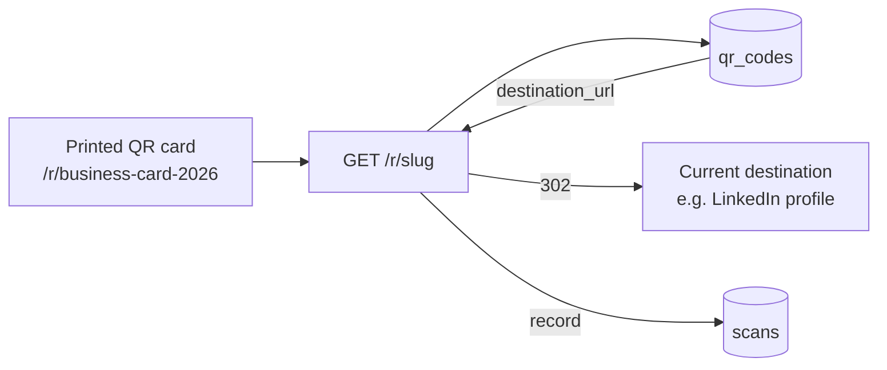

# mehboob-portfolio — QR Manager Spec

The flagship feature: **dynamic QR codes with mutable destinations** + privacy-safe scan analytics.

## Concept

A printed QR card points to `https://<domain>/r/<slug>`. The server looks up the slug, records a scan, and 302-redirects to the QR's **current** destination — which can be edited in the admin at any time. **The printed card never goes stale.**

## Redirect behavior

| Condition | Behavior |
|---|---|
| slug found, active | record scan → `302` destination |
| slug found, inactive | redirect (no scan recorded) |
| slug missing / deleted | `404` |

- **302 (temporary)** on purpose — search engines must not cache the target (destinations change).
- Scan recording is best-effort: any error is swallowed so the redirect always works.

## Scan analytics — what we capture

| Field | Source | Notes |
|---|---|---|
| `ip_hash` | request IP | sha256 — **raw IP never stored** |
| `device` | UA parse | mobile / tablet / desktop |
| `device_model` | UA parse | e.g. "iPhone 14" |
| `browser` | UA parse | family + version |
| `os` | UA parse | family + version |
| `app_source` | UA sniff | WhatsApp / LinkedIn / Instagram / Facebook / Twitter / Telegram / Slack / WeChat / LINE / Chrome / Camera / Firefox / Edge / Direct |
| `language` | Accept-Language | first locale, truncated |
| `country` / `city` | proxy headers | CF-IPCountry, CF-IPCity, X-Vercel-*, X-Country-Code, X-City-Name |
| `referrer` | Referer | truncated |
| `utm_source/medium/campaign` | query params | campaign falls back to the QR's campaign name |

## Admin UX

- **QR list** — all codes, campaign filter, active toggle, delete/restore/purge.
- **QR create/edit** — slug, label, campaign, destination URL (validated), active flag.
- **QR stats** — per-QR analytics: totals, device/browser/OS breakdown, app-source pie, country/city table, UTM table, per-day timeline.
- **CSV export** — `/admin/qr/<id>/export-scans.csv` (full scan rows).
- **Campaigns** — name + slug, CRUD with soft delete.
- **Leads** — contact form submissions, list + CSV + soft delete.

## URL validation

`_valid_destination_url()` in `app/admin.py` — destinations must be http(s) URLs; invalid ones are rejected at save time.

## Privacy checklist

1. ✅ Raw IPs never stored (sha256 hash only).
2. ✅ Geo only from headers — no geo-IP lookups, no tracking scripts.
3. ✅ Best-effort recording — analytics failure never blocks the redirect.
4. ✅ Soft-delete on scans lets you purge data if asked.

## Testing

`tests/test_qr.py` covers: valid redirect, scan recording, inactive QR (no scan), missing slug → 404, UTM capture.

## Related

- [database.md](database.md) — `qr_codes`, `scans`, `campaigns` schema
- [admin.md](admin.md) — admin routes
- [architecture.md](architecture.md) — request flow
